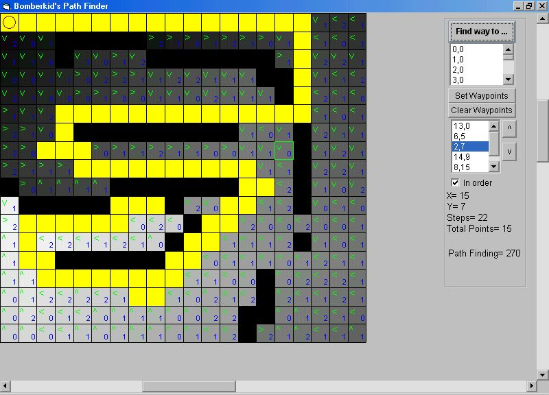

## A Path Finder

### Description

In this update I added some things: now you can also search for a path, using waypoints. You can set the program to find the best way between these waypoints, or you can set it to follow the waypoints in a given order. The code isn't very fast if you use the waypointmethod ... Hope you can use it. I'd appreciate it if you give me any comments or tell me some bugs. Thanx
 
### More Info
 

             |
---                |---
**Submitted On**   |2003-05-23 17:57:04
**By**             |[Jerous](https://github.com/Planet-Source-Code/PSCIndex/blob/master/ByAuthor/jerous.md)
**Level**          |Intermediate
**User Rating**    |5.0 (20 globes from 4 users)
**Compatibility**  |VB 6\.0
**Category**       |[Games](https://github.com/Planet-Source-Code/PSCIndex/blob/master/ByCategory/games__1-38.md)
**World**          |[Visual Basic](https://github.com/Planet-Source-Code/PSCIndex/blob/master/ByWorld/visual-basic.md)
**Archive File**   |[A\_Path\_Fin1591525232003\.zip](https://github.com/Planet-Source-Code/jerous-a-path-finder__1-45379/archive/master.zip)

